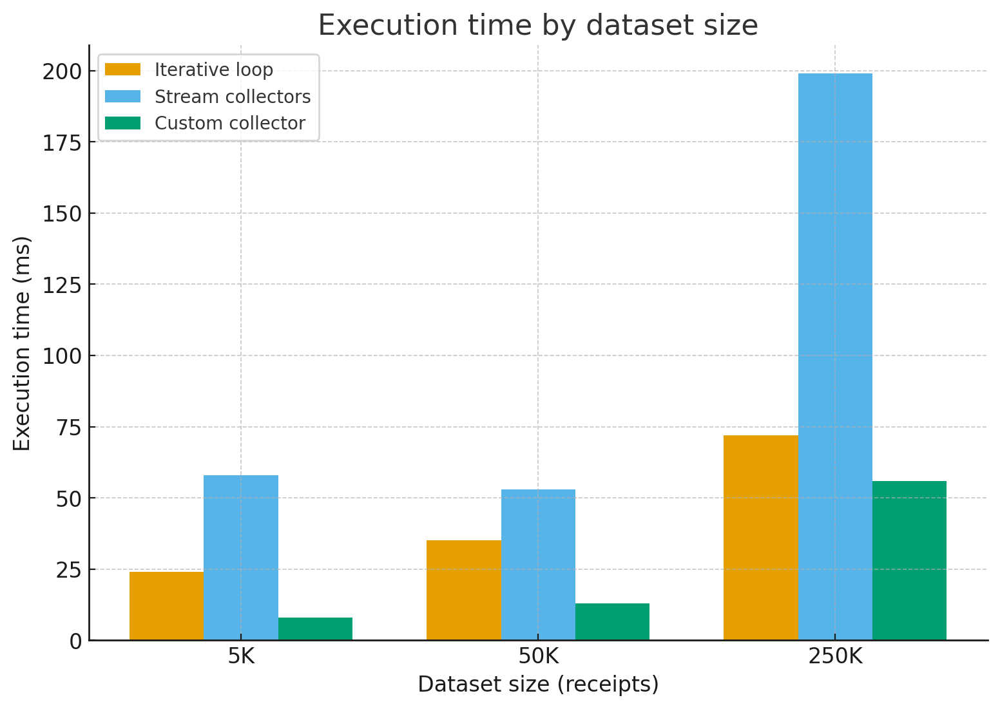

# Отчет

## Лабораторная работа №1

выполнили:

- Щербаков Александр 
- Горинов Даниил

## Задание

Предметная область: "интеграция магазина с банком"

1. Написать для согласованной предметной области как минимум 3 базовых класса и генераторы объектов.
   Генератор должен уметь создавать указанное количество различных объектов сответствующего класса со случайными
   (но при этом валидными) характеристиками. Класс, представляющий собой массовый объект должен обязательно содержать поля следющих типов:
- один из примитивов (int, long, double)
- String
- дата/время (LocalDate, LocalTime, ...)
- enum
- record
- массив или коллекция
  Остальные поля - произвольные, какие нужны для предметной области.
  Два оставшихся класса должны представлять собой дополнительные атрибуты и характиристики массового класса.

2. С помощью генератора создать коллекцию объектов.
3. Написать код, реализующий расчет согласованных агрегированных статических данных тремя способами:
   3.1. Итерационным циклом по коллекции
   3.2. Конвейером с помощью Stream API на базе коллекторов из стандартной библиотеки
   3.3. Конвейером с помощью собственного коллектора.

4. Для каждого варианта измерить время выполнения, зафиксировав моменты начала и окончания расчета для количества элементов в коллекции - 5000, 50000 и 250000. Время измерять с помощью методов класса System или Instant


## Результат работы теста

```
Sample statistics (iterative variant):
ReceiptStatistics{
  totalRevenue=5710057.500335116
  averageReceiptAmount=1142.0115000670232
  minReceiptAmount=36.99998318556258
  maxReceiptAmount=3430.3796769574005
  totalOrders=5000
  ordersByStatus={PAID=1271, PENDING=1296, DELIVERED=1248, FAILED=1185}
  totalItemsSold=55853
  uniqueCustomers=5000
  totalLoyaltyPoints=568490
  revenueByMonth={1=481953.16980766784, 2=419957.0062774844, 3=472529.66578268516, 4=440363.7413206926, 5=484481.253604041, 6=461693.9837572668, 7=511600.55908076145, 8=489061.4226956091, 9=450754.84336234484, 10=520588.45824083895, 11=483213.59837752813, 12=493859.7980281894}
}

Dataset size: 5_000 receipts
 - Iterative loop: 24 ms
 - Stream collectors: 58 ms
 - Custom collector: 8 ms
 
Dataset size: 50_000 receipts
 - Iterative loop: 35 ms
 - Stream collectors: 53 ms
 - Custom collector: 13 ms

Dataset size: 250_000 receipts
 - Iterative loop: 72 ms
 - Stream collectors: 199 ms
 - Custom collector: 56 ms
```

### График сранения результатов:




